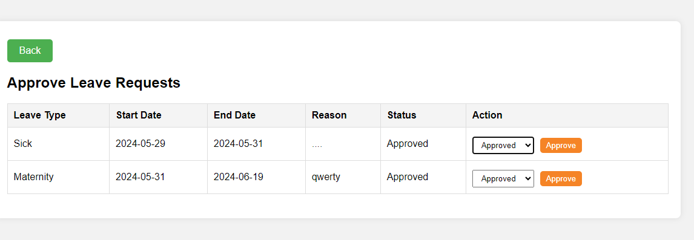
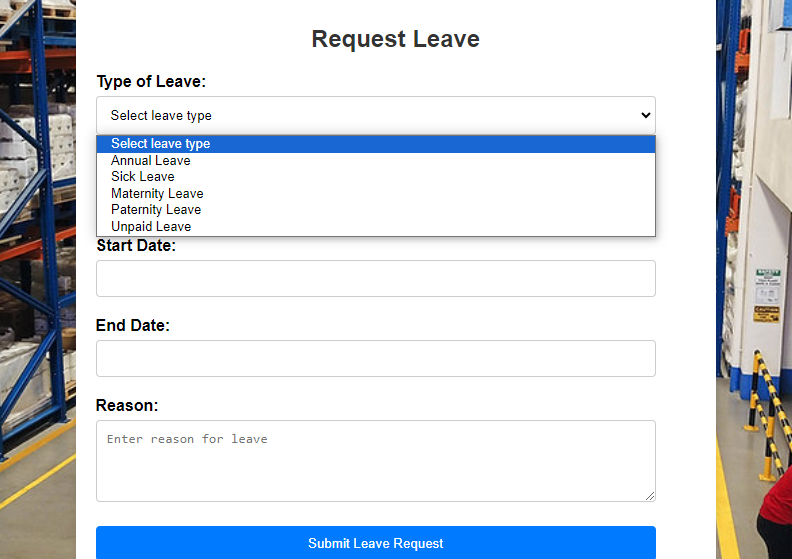
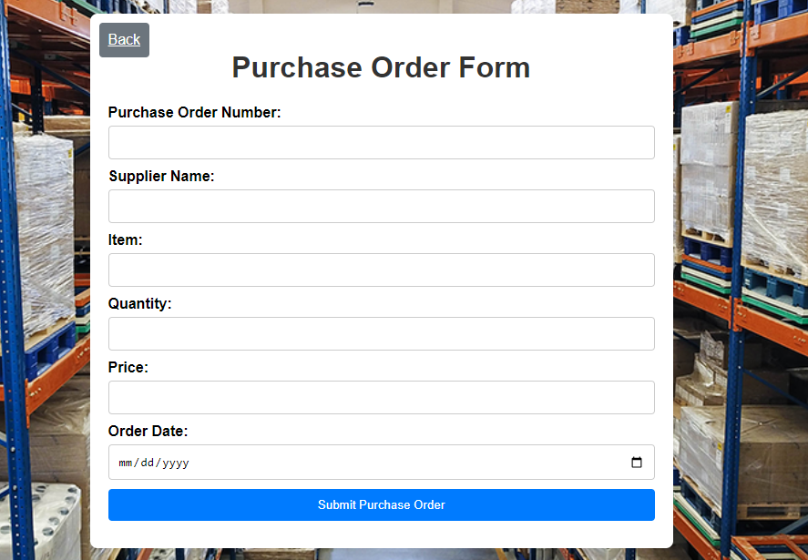

"Mobile Approval Project" 

Project Description: Mobile Approval System
Overview
The Mobile Approval System is a comprehensive mobile application designed to streamline and automate the approval processes within an organization. This application allows employees to submit leave requests, and managers to review and approve these requests. Additionally, the system facilitates handling of financial transactions, such as expense approvals and budget allocations, ensuring a seamless and efficient workflow.

Features
Leave Request Management

1. Submission of Leave Requests: Employees can submit leave requests directly through the app, specifying the type of leave, dates, and reason.
2. Leave Balance Check: Users can check their available leave balance before submitting a request.
3. Manager Notifications: Managers receive real-time notifications of new leave requests for review.
4. Approval/Denial: Managers can approve or deny leave requests with comments for feedback.
5. Leave History: Employees and managers can view the history of leave requests and their statuses.

Transaction Handling

1. Expense Approvals: Employees can submit expense reports with attached receipts for manager approval.
2. Budget Requests: Departments can request budget allocations or adjustments, which are routed to finance managers for approval.
3. Transaction Tracking: The system tracks all financial transactions and approvals, providing a transparent audit trail.
4. Notifications: Both submitters and approvers receive notifications on the status of their transactions.

User Roles and Permissions

1. Employee Role: Can submit requests, view status, and history.
2. Manager Role: Can review, approve/deny requests, and provide feedback.
3. Admin Role: Can manage user roles, view all requests and transactions, and generate reports.

Reporting and Analytics

1. Dashboard: Real-time dashboard displaying pending approvals, recent transactions, and key performance indicators.
2. Reports: Generate detailed reports on leave balances, expense approvals, and budget allocations.
3. Analytics: Insights and analytics on approval times, transaction volumes, and department-wise expenses.

Security

1. Authentication: Secure login with multi-factor authentication.
2. Data Encryption: All data transmissions are encrypted to ensure security and confidentiality.
3. Role-Based Access Control: Ensures that users can only access data relevant to their role.

Technology Stack
1. Frontend: React Native for cross-platform mobile app development.
2. Backend: Node.js with Express for API development.
3. Database: MongoDB for storing user data, requests, and transaction records.
4. Notification Service: Firebase Cloud Messaging for push notifications.
5. Authentication: OAuth 2.0 for secure user authentication.

Benefits
1. Efficiency: Automates routine approval processes, reducing time and effort.
2. Transparency: Provides clear visibility into approval statuses and transaction histories.
3. Accessibility: Allows users to manage approvals and transactions anytime, anywhere from their mobile devices.
4. Improved Communication: Enhances communication between employees and managers with real-time notifications and feedback.

Use Cases
1. Leave Management: An employee submits a leave request through the app, which the manager reviews and approves/denies. The employee receives a notification of the decision.
2. Expense Reporting: An employee submits an expense report with attached receipts. The manager reviews and approves the expenses, and the finance department processes the reimbursement.
3. Budget Requests: A department head submits a request for additional budget allocation. The finance manager reviews the request, approves it, and the department is notified of the new budget availability.

## Photo

## Photo

## Photo
